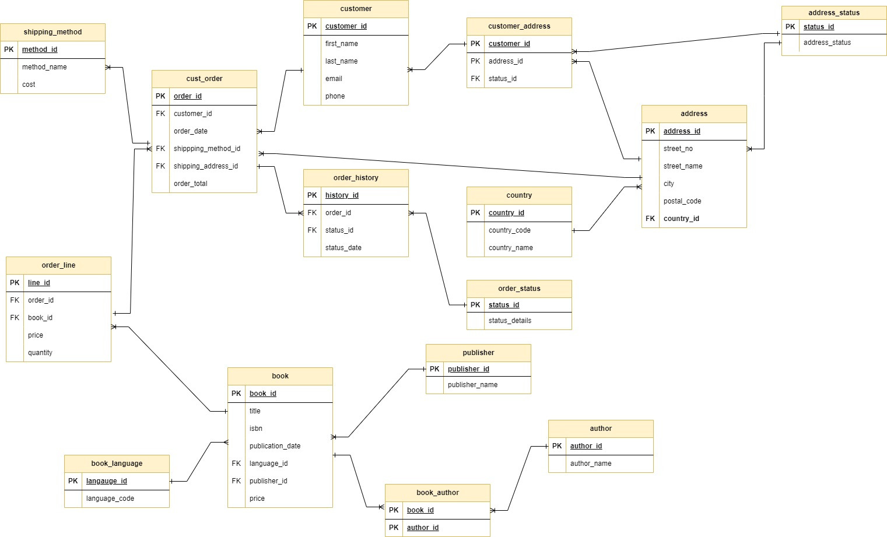

# ERD Diagram

## Tables in the database
book
book_id pk int 
title varchar
isbn varchar
publication_date date
language_id int - fk -> book_language
publisher_id int - fk -> publisher_id
price 

author
author_id int
author_name varchar

book_author
book_id int fk - book
author_id int fk - author

publisher
publisher_id int pk 
publisher_name varchar

book_language
language_id pk int 
language_code varchar

customer
customer_id -pk int 
first_name varchar
last_name varchar
email varchar
phone int

county 
country_id pk int
country_code varchar
country_name varchar

address_status
status_id pk int
address_status 

address
address_id pk - int
street_no  varchar
street_name  varchar
city varchar
postal_code varchar
country_id fk -> country

customer_address
customer_id fk -> customer 
address_id fk -> address
status_id fk -> address_status

shipping_method
method_id pk
method_name varchar
cost decimal

cust_order
order_id pk int
customer_id fk -> customer
order_date date
shipping_method_id fk -> shipping_method
shipping_address_id fk -> address
order_total decimal

order_status
status_id pk
status_details varchar

order_line
line_id pk
order_id fk cust_order
book_id fk book
price decimal
quantity int

order_history
history_id int 
order_id fk -> cust_order
status_id fk -> order_status
status_date date

## Table relationships - this guided the design of our ERD
author - book_author one to many (1:N)- one author can be associated with many books (if they wrote multiple books)
* book - book_author one to many (1:N) - one book can be associated with many entries in the book_author table (if it has multiple authors)
* book_author - author - book - many to many (M:N) - one author can write many books and one book can have many authors
* book - book_language - many to one (N:1) - many books can have one language. 
* book - publisher - many to one (N:1) - many books can have the publisher
* customer - customer_address - one to many (1:N)- one customer can have multiple addresses
* address - customer_address - one to many (1:N)- one can address can associated with multiple customer addresses
* customer_address - address_status - many to one (N:1) many customer_addresses can point to same status eg current
* customer - customer_address - address - M:N  - many to many
* address to address_status - N:1 - many address can share the same status 
* address to country - many to one (N:1) - many address can be in one country
* customer to cust_order - one to many (1:N)- one customer can place many orders
* cust_order - address (N:1) many to one - many orders can be shipped to the same address
* cust_order - shipping_method (N:1) - many orders can use the same shipping method
* cust_order - order_line - one to many (1:N) - one order can consist of many lines (books)
* book - order line - one to many (1:N) - one book can appear in many different order lines
* order_line - cust_order - book - M:N - many to many
* cust_order -order_history - one to many (1:N) - one order can have many history entries 
* order_status - order_history one to many (1:N) - one status type can apply to many different  